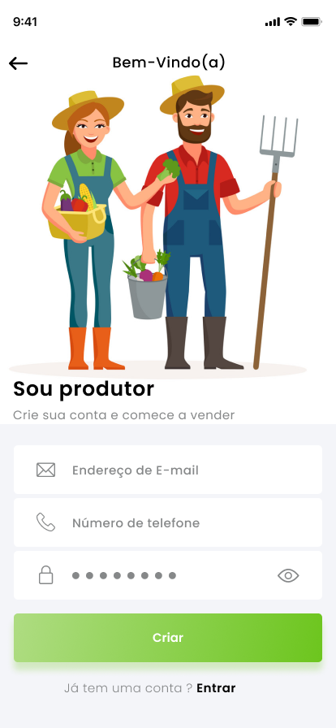

# User Stories

  

- Índice
  - [Autenticação e Cadastro](#autenticação-e-cadastro)
    - [RF01 - Realizar Cadastro](#rf01---realizar-cadastro)
    - [RF02 - Realizar Login](#rf02---realizar-login)
    - [RF03 - Cadastro de Produtor](#rf03---cadastro-de-produtor)

[Voltar ao README](https://github.com/HortaShop-PS)

## Autenticação e Cadastro

### RF01 - Realizar Cadastro

Desenvolvido por: [Thiago](https://github.com/thiagogonzagadev)

Revisado por: [Antonio André](https://github.com/andrebarceloschagas)

Como um usuário sem conta, eu quero me cadastrar no aplicativo para que eu possa começar a comprar hortaliças.

### RF02 - Realizar Login

Como um usuário cadastrado, eu quero fazer login no aplicativo para acessar minha conta e realizar compras.

### RF03 - Cadastro de Produtor

Como um produtor, eu quero cadastrar-me como vendedor para que possa oferecer meus produtos na plataforma.

